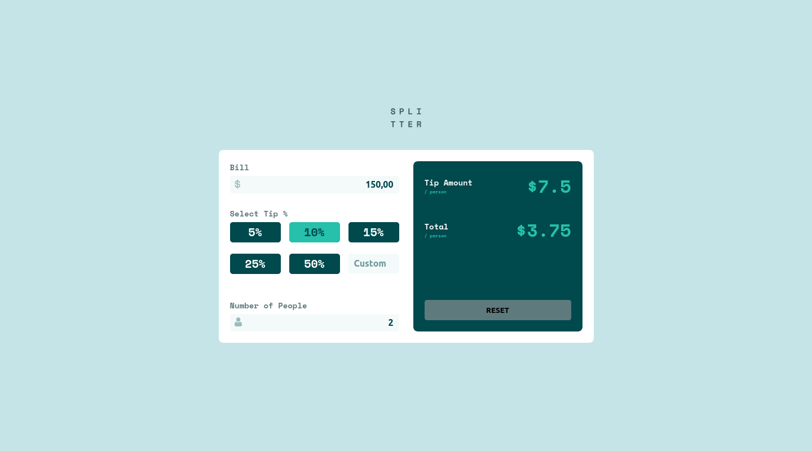

# Frontend Mentor - Tip calculator app

Essa é a solução para o [Tip calculator app challenge on Frontend Mentor](https://www.frontendmentor.io/challenges/tip-calculator-app-ugJNGbJUX). Os desafios do Frontend Mentor ajudam você a melhorar suas habilidades de codificação criando projetos realistas.

## Índice

- [Frontend Mentor - Tip calculator app](#frontend-mentor---tip-calculator-app)
  - [Índice](#índice)
  - [Visão geral](#visão-geral)
    - [Challenge](#challenge)
    - [Screenshot](#screenshot)
    - [Links](#links)
  - [Meu processo](#meu-processo)
    - [Construído com](#construído-com)
  - [Autor](#autor)

## Visão geral

### Challenge

O desafio é construir o aplicativo de calculadora de gorjetas e fazê-lo parecer o mais próximo possível do design.

Seus usuários devem ser capazes de:

* Visualize o layout ideal para o aplicativo, dependendo do tamanho da tela do dispositivo

* Veja os estados de foco para todos os elementos interativos na página

* Calcule a gorjeta correta e o custo total da conta por pessoa

### Screenshot

### Links

- Clique no [link](https://github.com/eliseuSousa/tip-calculator) para acessar o repositório com a solução.

- URL do site: [Frontend Mentor - Tip calculator app](https://eliseusousa.github.io/tip-calculator/)

## Meu processo

### Construído com 
- HTML
- CSS
- JavaScript

## Autor 
- Site - [Eliseu Sousa](https://eliseusousa.github.io/portfolio/)
- Frontend Mentor - [@eliseuSousa](https://www.frontendmentor.io/profile/eliseuSousa)